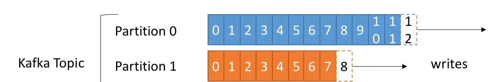

# Kafka Fundamentals 

## Topic

1. It is **particular stream of data;** Similar to tb in a db 
2. Identified by _name_
3. topic are split in __partitions__ which is ordered and each message within a partition gets an icrementaL IDs called __offset__
4. You need to specify the number of partition at time of creation  which can be modified later. 

#### Example
Say you have a fleet of trucks, each truck reports its GPS location to kafka
You can have a topic __trucks_gps__ that contains the postion of all trucks 
Each truck will send a message to kafka every 20 seconds, each message will contain the truck ID and the truck position 
We choose to create a topic with 10 partition(arbitary number)
    

### Gotchas 
1. Offset only have a meaning for a specific partition 
2. Order is gaurenteed only within a partition (not across partitions)
3. Data is kept only for limited time (default is 1 week)
4. once the data is written to a partition, **it can't be chnaged(immutability)**, it can't be updated after insertion
5. Data is assigned randomly to a partition unless a key is provided 
    
## Brokers 

1. A kafka cluster is composed of multiple brokers(servers)
2. Each broker is **identified with it's ID(integer)**
3. Each broker contain certain topic partition as kafka is distributed
4. After connecting to any broker(called a **bootstrap broker**), you will be connected to the entire cluster 
5. A good number to get started is 3 brokers, but some big clusters have over 100 brokers. 
    Ex: **[broker101]  [broker102]   [broker103]**

## Brokers and Topics 
1. Kakfa will assign the topic and distribute the topic on all brokers, so all parition will not end up on same broker. 

### Topic replication factor
1. Topics should have a replication factor > 1 (usually between 2 and 3(this being **gold standard**))
2. This way if a broker is down, another broker can serve the data. 

#### Leader 

    1. At any time only ONE broker can be leader for a given parition
    2. Only that leader can  recieve and serve data for partition 
    3. The other brokers will synchronize the data 
    Therefore each partition has one leader and **multiple ISR(In-Sync Replica)**
    4. If leader goes down, then the ISR will become leader untill the actual leader is back

## Producers

1. Producers write data to topics(which is made of partitions)
2. Producers automatically know to which broker and partition to write to
3. In case of broker failure, the producers will recover automatically 

### Acknowledgement

1. Producers can choose to recieve acknowledgement of data writes: 
    * **acks=0**: Producer wont wait for ack **(possible data loss)**
    * **acks=1**: Producer will wait for leader acknowledgement**(limited data loss)**
    * **acks=1**: **Leader + Replicas* acknowledgement* No data loss 

### Message Keys

1. Producers can choose to send **key** with the message(string , number, etc..)
2. If **key=null**, data is send round robin(broker 101 then 102 then 103..)
3. If a key is send, then all messages for that key will allways go the same partition 
4. A key is basically sent **if you need message ordering for a specific field(ex: truck_id), like same truck data go to same partition**
5. This is based on **key hashing**

## Consumers 

1. Consumers read data from topic(identified by name)
2. Consumers know which broker to read from 
3. In case of broker failure, consumers know **how to recover** 
4. Data is read in order **within each partition**. Across partition the order is not gaurentted. 

### Consumer Groups(reps an application)

1. Consuder read data in consumer groups
2. Each consumer within a group reads from exclusive paritions 
3. If you have more consumers than partitions, some consumers will be inactive 
> __NOTE__: Cosumers will automatically use a group coordinator and a consumer Coordinator to assign a consumers to a partition 

4. If you have **more consumers than partitions**, some consumers will be inactive(you would want this if you think some consumer may fail so you want a backup consumer ready).

### Consumers Offsets 

1. Kakfa stores the offset at which a consumer group has been reading
2. The offset commited live in a kafka topic names **'__consumer_offsets'** 
3. When a consumer in a group has been processed data recieved from kafka, it should be committing the offsets 
4. If a consumer dies, it will be able to read back from where it left off thanks to the committed consumers offstes 
 

5. **Delivery Semantics for Consumers**: 
    * consumers choose when to commit offsets. 
    * there are 3 delivery semantics: 
        1. __At most once:__ 
            * offsets are comitted as soon as the message is recieved
            * If the processing goes wrong. The message will be lost(it wont be read again)
        2. __At least once(usually preffered):__
            * offsets are comitted after the message is processed
            * if the processing goes wrong, the message will be read again
            * This can result in **duplicate processing of messagees**. Make sure your processing is **idempotent**(i.e. processing again the messages wont impact your system ) 
        3. __Exactly Once(Holy Grail)__
            * Can be achieved for Kafka => Kafka workflows using Kafka Streams API
            * For Kafka => External Systems workflows, use an **idempotent** consumer. 
            * For kafka => External systems workflowsm use idempotent consumers. 

## Kafka Broker Discovery 

1. Every kafka broker is also called a __bootstrap server__
2. That means that you only need to connect to one broker and each broker is bootstrap server so it knows about all other broker, topics and partitions as meta data and you will be connected to the entire cluster. 
3. Each broker knows about **all brokers, topics and partitions(metadata)**

 

## Zookeeper 

1. Zookeeper manages brokers(keeps a list of them )
2. Zookeeper helps in performing leader election for partitions 
3. Zookeeper sends notifications to kafka in case of change (e.g. new topic, broker dies, broker comes up, delete topics, etc)
4. **kafka cant work without zookeeper**
5. Zookeeper by design operates with an odd numbers of servers
6. Zookeepers has a leader(handle writes) the rest of the servers are followers (handles reads)
7. Zookeeper does NOT store consumer offsets with Kafka >v0.10

 

## Kafka Gaurentees (Summary)

1. Messages are appended to a topic-partition in the order they are sent 
2. Consumers read messages in the order stored in a topic-partition 
3. With a replication factor of N, producers and consumers can tolerate up to N-1 Brokers being down 
4. This is why a replication factor of 3 is good idea: 
    * allows for one broker to be taken down for maintainence 
    * allows for another broker to be taken down unexpectedly 
5. As long as the number of partitions remains constant for a topic(no new partitions), the same key will always go to the same partition. 

 