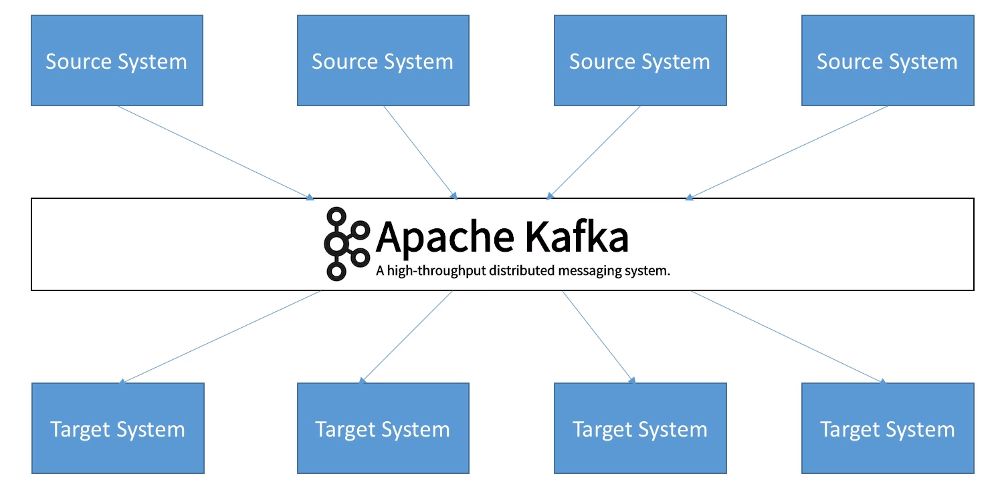

# ApacheKafka

Apache kafka allows to decouple data-stream and source systems. This decoupling between source and target system is main adv of using apache kafka 

* You can have any data stream in kafka which can be put to any system like db, email systems , other system.
* Kafka is __Distributed, resilient architecture, fault tolerant__
* Horizontally Scalable and High Performance (Latency of <10ms)(Real-time)
* LinkedIn, Uber, Airbnb, Netflix, etc 
## __Use Cases__: 
* Messaging Systems. Activity Tacking, Gather Metrics from many different locations, Application log gathering, Stream processing(with the kafka streams API or Spark), De-coupling of system dependencies, Integration with Spark, FLink, Storm, Hadoop and many big data solution 
* NFlix uses Kafka to apply recommendations in real-time, Uber uses kafka to gather user, taxi and trip data in real-time 